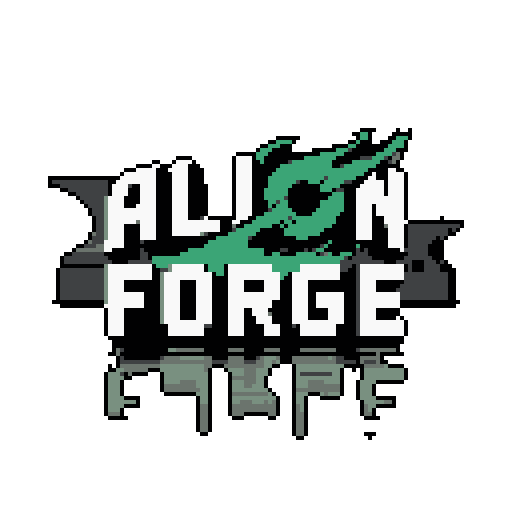

<p align="center">
  
</p>

### A modern, cross-platform suite of tools designed for system optimization, security, and administration, managed through a clean and intuitive graphical interface.

---

## The Evolution: From V1 to Alion Suite

This project started as **Alion V1**, a simple yet effective Windows Batch (`.bat`) script designed to automate common system tasks. Recognizing the need for a more robust and cross-platform solution, the project was completely rebuilt from the ground up in Python.

The **Alion Suite** is the result of this evolution. It's a sophisticated application built with **PySide6** that offers specialized toolsets for different operating systems and purposes, all accessible from a single, dynamic launcher.

---

## Features

* **Multi-Version Launcher:** A sleek, animated launcher lets you choose the toolset that's right for you.
* **Specialized Toolsets:** Different versions of Alion, each with a unique theme and curated set of tools.
* **Data-Driven UI:** The interface is built dynamically, making it easy to add new categories and tools.
* **Real-time Console Output:** Each tool has a dedicated console to show the output of its execution in real-time.
* **Smart Search:** Instantly filter tools in the sidebar to find what you need.
* **Multilingual Support:** The entire interface supports both English and Portuguese.

---

## The Suite

The Alion Suite is composed of four distinct versions, each with its own focus and visual identity.

| Logo                                                                                                  | Version          | Target OS      | Description                                                                                             |
| :---------------------------------------------------------------------------------------------------- | :--------------- | :------------- | :------------------------------------------------------------------------------------------------------ |
|                                       | **Alion APEX**   | Linux          | A collection of tools for Linux system administration, optimization, and package management.           |
|                                      | **Alion Forge**  | Windows        | The spiritual successor to Alion V1, rebuilt for the modern Windows environment with powerful PowerShell commands. |
|                                        | **Alion Brew**   | macOS          | A curated set of tools for macOS users, leveraging Homebrew and native system capabilities.             |
|                            | **Alion Defender** | Any (Security) | A specialized toolkit for Blue Team security operations, including network analysis and system defense tools. |

---

## Installation & Usage

Getting started with Alion Suite is easy. We provide a simple one-line command for each platform that downloads and runs the installer script.

### For Windows (PowerShell)

Open PowerShell and run:

```powershell
irm https://raw.githubusercontent.com/joaodrmmd/Alion-Suite/main/install.ps1 | iex
```

### For Linux & macOS (Bash)

Open your terminal and run:
```bash
curl -sS https://raw.githubusercontent.com/joaodrmmd/Alion-Suite/main/install.sh | sudo bash
```


*Note: The installer scripts are a future goal. For now, users must run the project from source.*

### Running from Source (for Developers)

Clone the repository:
``` 
git clone https://github.com/joaodrmmd/Alion-Suite.git
cd Alion-Suite
```
Install dependencies:
```
pip install PySide6 Pillow
```
Run the launcher:
```
python launcher.py
```
### Contributing

Contributions are what make the open-source community such an amazing place to learn, inspire, and create. Any contributions you make are greatly appreciated.

If you have a suggestion that would make this better, please fork the repo and create a pull request. You can also simply open an issue with the tag "enhancement".

    Fork the Project

    Create your Feature Branch (git checkout -b feature/AmazingFeature)

    Commit your Changes (git commit -m 'Add some AmazingFeature')

    Push to the Branch (git push origin feature/AmazingFeature)

    Open a Pull Request

### License

Distributed under the MIT License. See LICENSE for more information.

### Contact

Project Link: https://github.com/joaodrmmd/Alion-Suite
